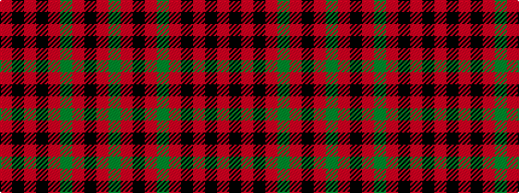

GRKRGRKRKR

It is a 10 stripe tartan.

<figure class="pat-woven">

<figcaption>idealised sample</figcaption>
</figure>

## Colour Sequence



## Tartans with this colour sequence

| Tartans |
|---------------|
| [Hebridean, South Uist](/variants/s10/g8r1k1r8g1r8k1r1k8r1~x6/)|
||
