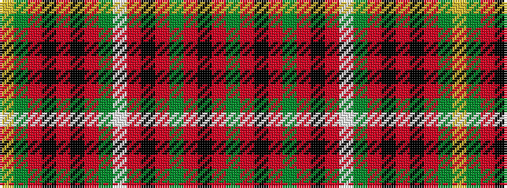

GRKRGRKRWGRKRKRGY

It is a 17 stripe tartan.

<figure class="pat-woven">

<figcaption>idealised sample</figcaption>
</figure>

## Colour Sequence



## Tartans with this colour sequence

| Tartans |
|---------------|
| [Unidentified Scarlett #8](/setts/s17/g2r20k2r2g3r2k18r3w1g3r20k2r2k18r2g2ly1~x2/)|
||
