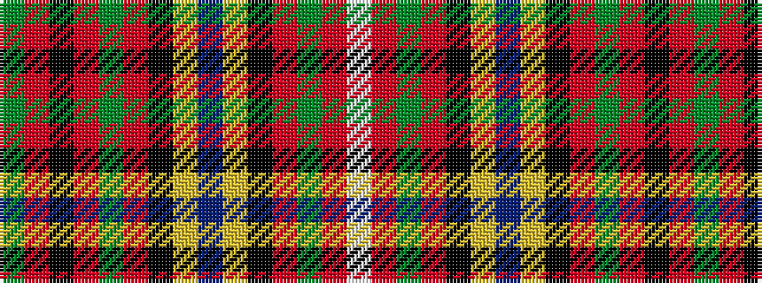

GRKRGRKYBYKRGRW

It is a 15 stripe tartan.

<figure class="pat-woven">

<figcaption>idealised sample</figcaption>
</figure>

## Colour Sequence



## Tartans with this colour sequence

| Tartans |
|---------------|
| [Livingstone (Australia) Official](/setts/s15/dg10r3k2r3dg10r8k2ly1n1ly1k2r20dg4r8w1~x2/)|
||
