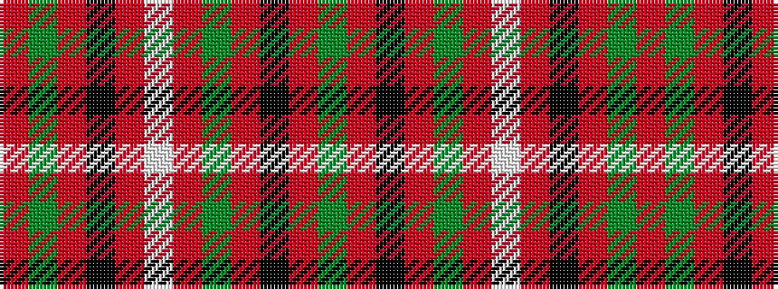

GRKRGRWRKRGR

It is a 12 stripe tartan.

<figure class="pat-woven">

<figcaption>idealised sample</figcaption>
</figure>

## Colour Sequence



## Tartans with this colour sequence

| Tartans |
|---------------|
| [MacNicol](/setts/s12/r6dg1r6k4r1lb1r1dg8r6k1r6dg1/)|
||
