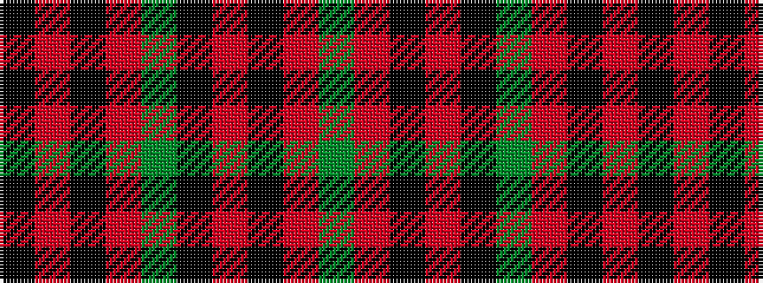

GRKRKGRKRK

It is a 10 stripe tartan.

<figure class="pat-woven">

<figcaption>idealised sample</figcaption>
</figure>

## Colour Sequence



## Tartans with this colour sequence

| Tartans |
|---------------|
| [Dinwoodie (Name)](/setts/s10/dy12o2k2o42k13g25o6k2r4k10~x2/)|
||
