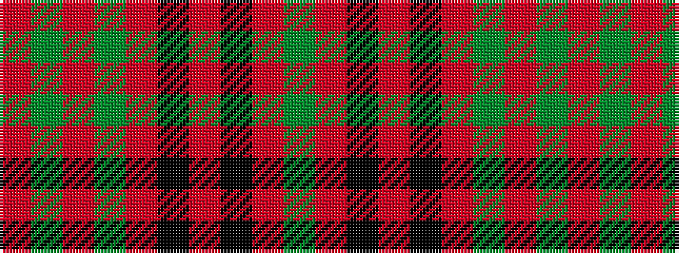

GRKRKRGRGR

It is a 10 stripe tartan.

<figure class="pat-woven">

<figcaption>idealised sample</figcaption>
</figure>

## Colour Sequence



## Tartans with this colour sequence

| Tartans |
|---------------|
| [Livingston](/setts/s10/dg12r3k1r3k1r4dg16r20dg2r8~x2/)|
||
| [Livingston](/setts/s10/dg12r4k1r2k1r4dg16r20dg2r8~x2/)|
||
| [Livingstone #2](/setts/s10/g12r4k1r2k1r4g16r20g2r8~x2/)|
||
