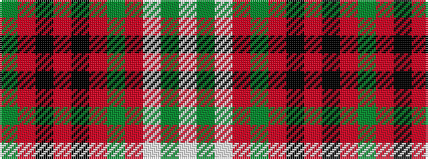

GRKRKRGRWGW

It is a 11 stripe tartan.

<figure class="pat-woven">

<figcaption>idealised sample</figcaption>
</figure>

## Colour Sequence



## Tartans with this colour sequence

| Tartans |
|---------------|
| [Livingston (Personal)](/setts/s11/g26r5k1r2k1r5g16r5w16g2w8~x2/)|
||
