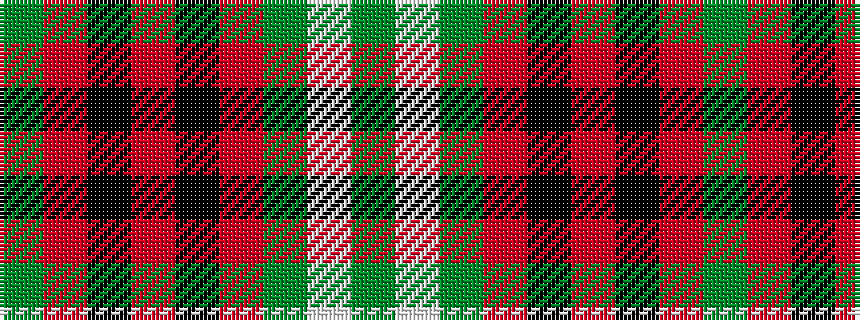

GRKRKRGWG

It is a 9 stripe tartan.

<figure class="pat-woven">

<figcaption>idealised sample</figcaption>
</figure>

## Colour Sequence



## Tartans with this colour sequence

| Tartans |
|---------------|
| [Morrison](/setts/s9/g5w2g8r9k3r4k3r17g3~x2/)|
||
| [Morrison LC](/setts/s9/dg9lb4dg15r17k5r7k5r32dg5/)|
||
