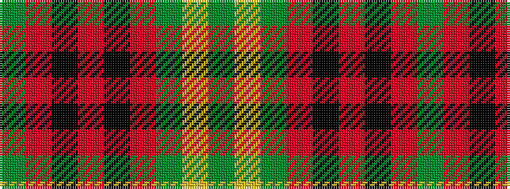

GRKRKRGYG

It is a 9 stripe tartan.

<figure class="pat-woven">

<figcaption>idealised sample</figcaption>
</figure>

## Colour Sequence



## Tartans with this colour sequence

| Tartans |
|---------------|
| [Morrison LC](/setts/dg9lr4dg15r17k5r7k5r32dg5/)|
||
