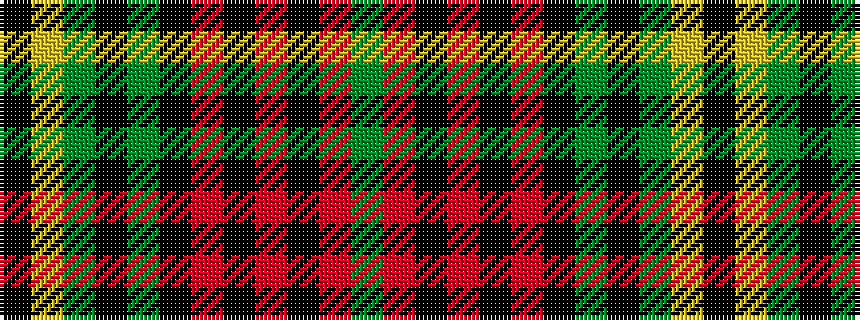

GRKRKRKGKGYK

It is a 12 stripe tartan.

<figure class="pat-woven">

<figcaption>idealised sample</figcaption>
</figure>

## Colour Sequence



## Tartans with this colour sequence

| Tartans |
|---------------|
| [Hampson (Name)](/variants/s12/k2ly2g2k2g17k2r2k2r17k2r5g2~x2/)|
||
