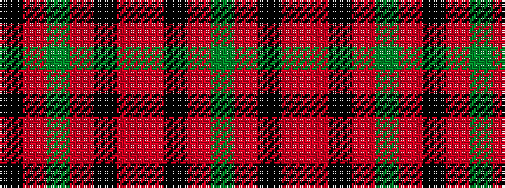

GRKRRKRGRK

It is a 10 stripe tartan.

<figure class="pat-woven">

<figcaption>idealised sample</figcaption>
</figure>

## Colour Sequence



## Tartans with this colour sequence

| Tartans |
|---------------|
| [Laporte](/setts/s10/y8r6k4r64o1k28r6y40r6k4~x2/)|
||
