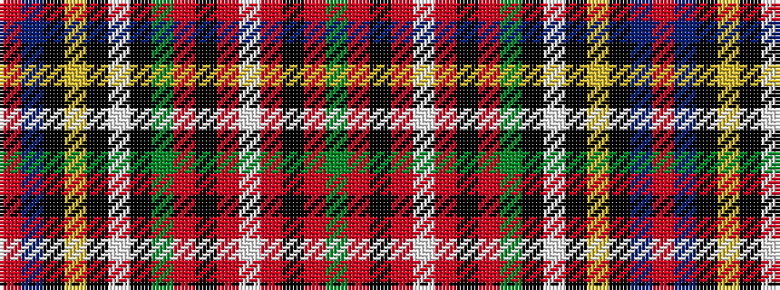

GRKRWRKRGKWKYKBR

It is a 16 stripe tartan.

<figure class="pat-woven">

<figcaption>idealised sample</figcaption>
</figure>

## Colour Sequence



## Tartans with this colour sequence

| Tartans |
|---------------|
| [Wcwm 1438](/variants/s16/r100db6k14ly2k3lb3k4dg14r6k3r3lb2r3k3r6dg14~x2/)|
||
