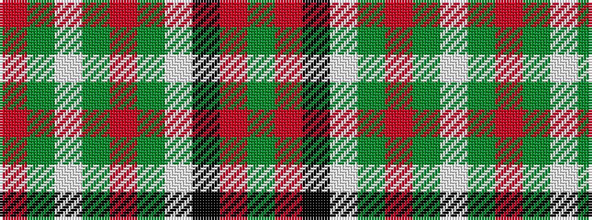

GRKWGRGWGR

It is a 10 stripe tartan.

<figure class="pat-woven">

<figcaption>idealised sample</figcaption>
</figure>

## Colour Sequence



## Tartans with this colour sequence

| Tartans |
|---------------|
| [Scott Dress #2](/setts/s10/dg7r3k3w54dg24r5dg5w5dg5r5~x2/)|
||
