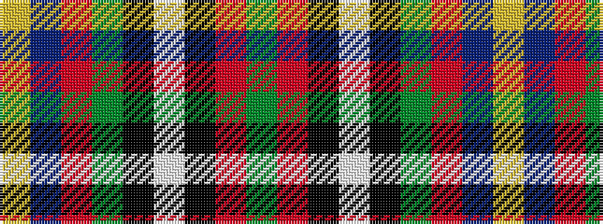

GRKWKGRBY

It is a 9 stripe tartan.

<figure class="pat-woven">

<figcaption>idealised sample</figcaption>
</figure>

## Colour Sequence



## Tartans with this colour sequence

| Tartans |
|---------------|
| [Stirling, University of](/setts/s9/dg90r1k10w6k4dg6r10db62ly8/)|
||
| [Stirling, University of](/setts/s9/g90r1k10w6k4g6r10db62ly8/)|
||
