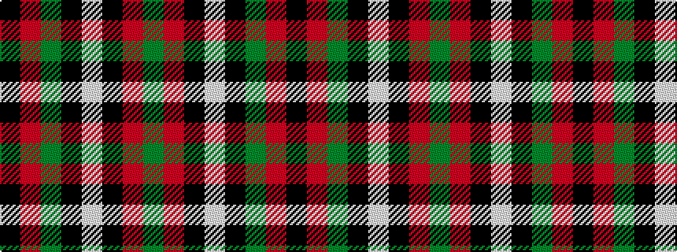

GRKWKGRK

It is a 8 stripe tartan.

<figure class="pat-woven">

<figcaption>idealised sample</figcaption>
</figure>

## Colour Sequence



## Tartans with this colour sequence

| Tartans |
|---------------|
| [MacHardy](/variants/s8/k3r1g32k12w1k12r1g3~x2/)|
||
| [MacHardy (Clans Originaux)](/variants/s8/g4r4k12w2k12g32r4k3~x2/)|
||
