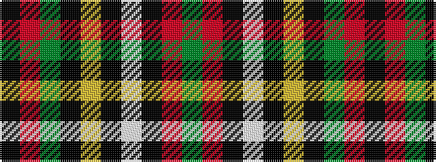

GRKWKYKGRK

It is a 10 stripe tartan.

<figure class="pat-woven">

<figcaption>idealised sample</figcaption>
</figure>

## Colour Sequence



## Tartans with this colour sequence

| Tartans |
|---------------|
| [Palmer, Arnold](/setts/s10/dg40r5k2w2k2ly3k2dg10r3k3~x2/)|
||
