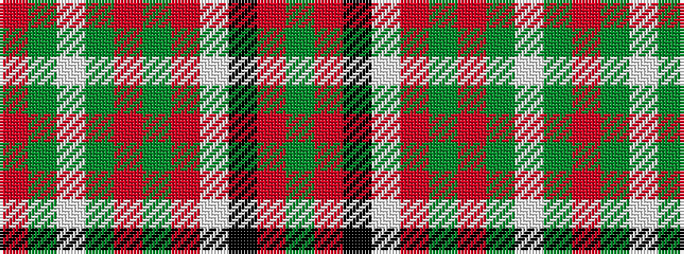

GRKWRGRGWGR

It is a 11 stripe tartan.

<figure class="pat-woven">

<figcaption>idealised sample</figcaption>
</figure>

## Colour Sequence



## Tartans with this colour sequence

| Tartans |
|---------------|
| [Scott, dress](/setts/s11/r4g5w2g5r4g14r10w30k1r2g4~x2/)|
||
