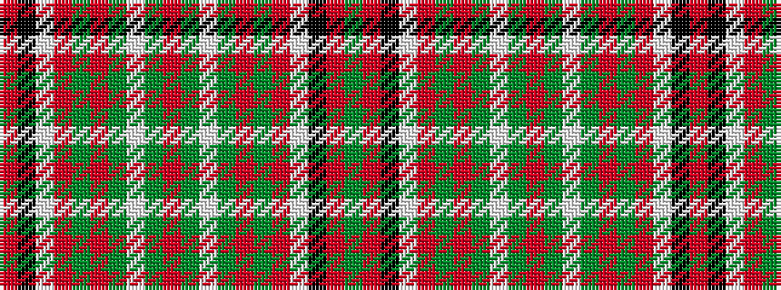

GRKWRGRGWGRGWGRGRWKR

It is a 20 stripe tartan.

<figure class="pat-woven">

<figcaption>idealised sample</figcaption>
</figure>

## Colour Sequence



## Tartans with this colour sequence

| Tartans |
|---------------|
| [Scott Dress](/variants/s20/dg4r2k1w30r10dg14r4dg5w2dg5r4~x2/)|
||
