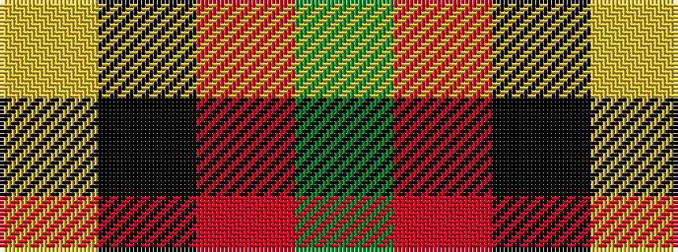

GRKY

It is a 4 stripe tartan.

<figure class="pat-woven">

<figcaption>idealised sample</figcaption>
</figure>

## Colour Sequence



## Tartans with this colour sequence

| Tartans |
|---------------|
| [Billy Apple](/setts/s4/g1r8k13ly1~x6/)|
||
| [Billy Apple® Red](/setts/s4/g1r13k8ly1~x6/)|
||
