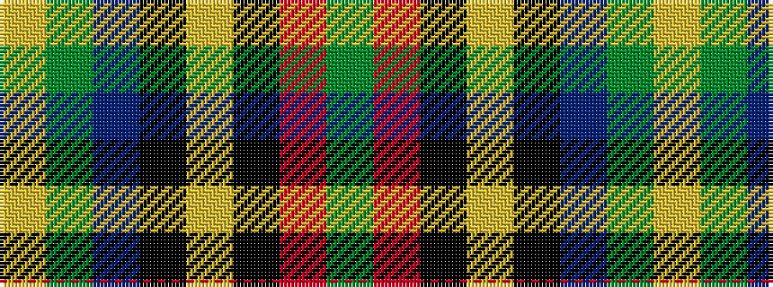

GRKYKBGY

It is a 8 stripe tartan.

<figure class="pat-woven">

<figcaption>idealised sample</figcaption>
</figure>

## Colour Sequence



## Tartans with this colour sequence

| Tartans |
|---------------|
| [Mensah](/setts/s8/ly3g9db9k1ly2k15r37g2~x2/)|
||
