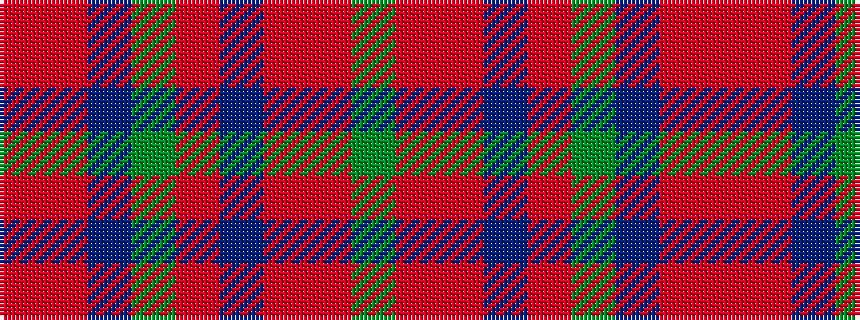

GRRBRGBRR

It is a 9 stripe tartan.

<figure class="pat-woven">

<figcaption>idealised sample</figcaption>
</figure>

## Colour Sequence



## Tartans with this colour sequence

| Tartans |
|---------------|
| [Diana Princess of Wales](/setts/s9/dg5r1r4db2r20dg12db16r4r1~x2/)|
||
