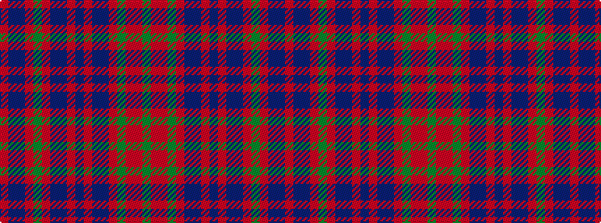

GRRGRBBRBRBBRGRBBR

It is a 18 stripe tartan.

<figure class="pat-woven">

<figcaption>idealised sample</figcaption>
</figure>

## Colour Sequence



## Tartans with this colour sequence

This pattern is a design lineage: every tartan below shares one colour order, whatever its owner —
near-identical designs are grouped, the largest lineage first (#112: the pattern is a tartan's
second parent, beside its family or clan).

<table class="sett-table">
<tbody>
<tr><td><a href="/variants/s18/r66t1db1r6dg30r6db1t1r3db16r3t1db1r54dg3o1r6dg6~x2~r2008029-o2704014/">Ramada</a></td></tr>
<tr><td class="sett-swatch"></td></tr>
<tr class="cluster-sep"><td></td></tr>
<tr><td><a href="/variants/s18/ri66dbi1db1ri6g30ri6db1dbi1ri3db16ri3dbi1db1ri54g3r1ri6g6~x2~ri2209032-dbi1605267-db0804274-r2208029/">Unidentified #34</a></td></tr>
<tr><td class="sett-swatch"></td></tr>
</tbody>
</table>

