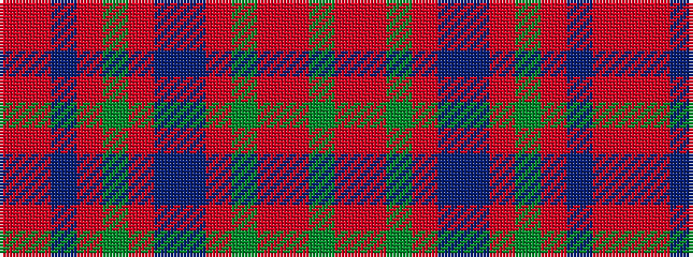

GRRGRBBRGRBRR

It is a 13 stripe tartan.

<figure class="pat-woven">

<figcaption>idealised sample</figcaption>
</figure>

## Colour Sequence



## Tartans with this colour sequence

| Tartans |
|---------------|
| [MacDonald of Glenaladale #2](/setts/s13/ri6r1db2ri2dg40ri6db13t1ri48dg2ri4r1dg4~x2/)|
||
| [MacDonald of Glencoe](/setts/s13/ri6r1db2ri2g40ri6db13t1ri48g2ri4r1g4~x2/)|
||
| [MacDonald of Glencoe Artifact Tartan Tartan Number: 1012. Earliest known date: 17th century Cargill fragment now at Fort William museum. See products available Copyright © Blair Urquhart, Comrie, 2015](/setts/s13/m6r1db2m2g40m6db13t1m48g2m4r1g4~x2/)|
||
