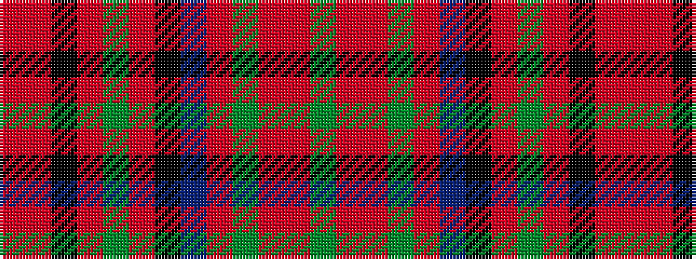

GRRGRBKRGRKRR

It is a 13 stripe tartan.

<figure class="pat-woven">

<figcaption>idealised sample</figcaption>
</figure>

## Colour Sequence



## Tartans with this colour sequence

| Tartans |
|---------------|
| [Glen Coe (District)](/setts/s13/r5r2k3r4g43r6k7t2r47g2r3r2g4~x2/)|
||
