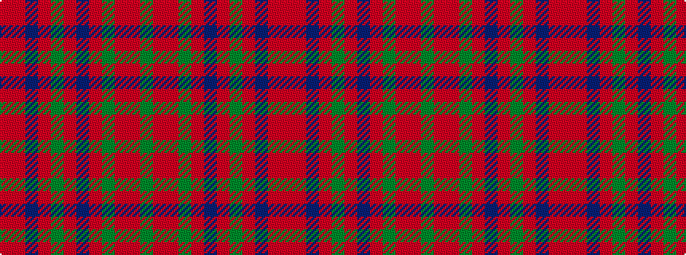

GRRGRBRGRBRR

It is a 12 stripe tartan.

<figure class="pat-woven">

<figcaption>idealised sample</figcaption>
</figure>

## Colour Sequence



## Tartans with this colour sequence

| Tartans |
|---------------|
| [MacDonald of Glenaladale](/variants/s12/ri7r2db2ri2g32ri6db12ri41g2ri5r2g5~x2/)|
||
| [MacDougall #5](/variants/s12/ri7r2db2ri2dg32ri6db12ri41dg2ri5r2dg5~x2/)|
||
