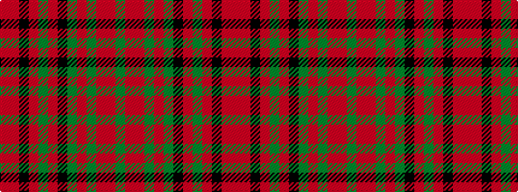

GRRGRGKRGRKRR

It is a 13 stripe tartan.

<figure class="pat-woven">

<figcaption>idealised sample</figcaption>
</figure>

## Colour Sequence



## Tartans with this colour sequence

| Tartans |
|---------------|
| [MacDonald of Glencoe #3](/setts/s13/g8ri1r6g3r40y2k12r6g30r3k2ri1r6~x2/)|
||
