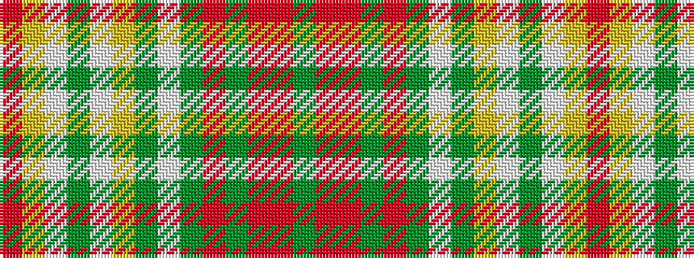

GRRGRGWGYWGWYR

It is a 14 stripe tartan.

<figure class="pat-woven">

<figcaption>idealised sample</figcaption>
</figure>

## Colour Sequence



## Tartans with this colour sequence

| Tartans |
|---------------|
| [Unidentified 9](/setts/s14/r35ly7w1dg3w1ly7dg19w2g17r12g5r5r5g2~x2/)|
||
