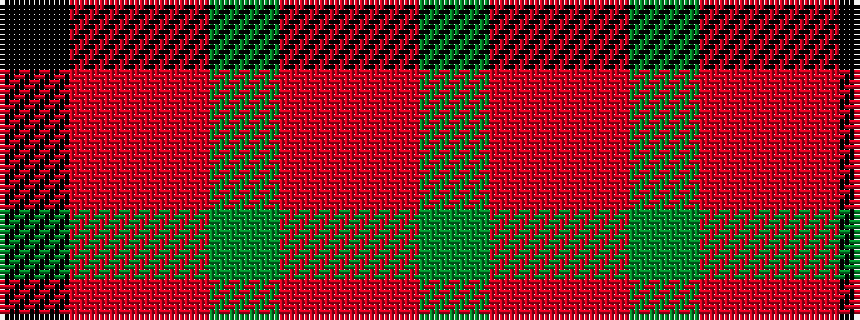

GRRGRRK

It is a 7 stripe tartan.

<figure class="pat-woven">

<figcaption>idealised sample</figcaption>
</figure>

## Colour Sequence



## Tartans with this colour sequence

| Tartans |
|---------------|
| [MacNab #3](/setts/s7/dg6r2ri2dg4ri2r12k1~x2/)|
||
| [MacNab (Crimson)](/setts/s7/dg28r7m7dg14m7r48k4~x2/)|
||
| [MacNab 5](/setts/s7/g6r2ri2g4ri2r12k1~x2/)|
||
| [MacNab 6](/setts/s7/g28r7m7g14m7r48k4~x2/)|
||
