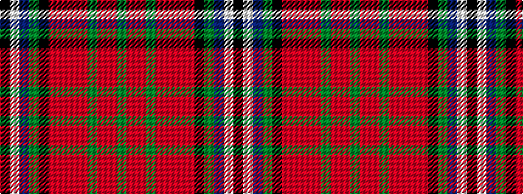

GRRGRRRRKGBWK

It is a 13 stripe tartan.

<figure class="pat-woven">

<figcaption>idealised sample</figcaption>
</figure>

## Colour Sequence



## Tartans with this colour sequence

| Tartans |
|---------------|
| [St. Andrews Grand (Fashion)](/variants/s13/g4r1ri1dg2r1ri1r1ri1k12g18db23w2k3~x2/)|
||
