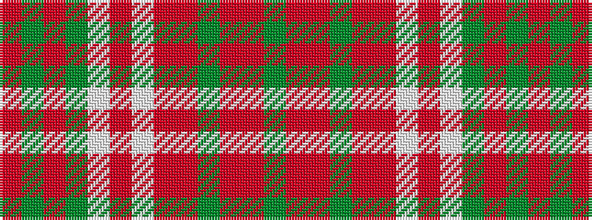

GRRGRRWRWGRGR

It is a 13 stripe tartan.

<figure class="pat-woven">

<figcaption>idealised sample</figcaption>
</figure>

## Colour Sequence



## Tartans with this colour sequence

| Tartans |
|---------------|
| [Parma](/variants/s13/oi32dy8oi1dy1lb1oi1lb1o1oi1dy1oii1oi4dy1~x4/)|
||
