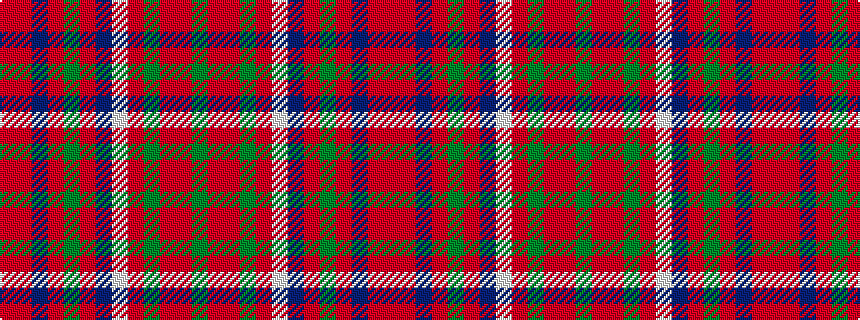

GRRGRWBRGRBRR

It is a 13 stripe tartan.

<figure class="pat-woven">

<figcaption>idealised sample</figcaption>
</figure>

## Colour Sequence



## Tartans with this colour sequence

| Tartans |
|---------------|
| [MacDonald of Glencoe](/variants/s13/dg3ri1r2dg2r16lb1db4r3dg13r1db1ri1r3~x2/)|
||
