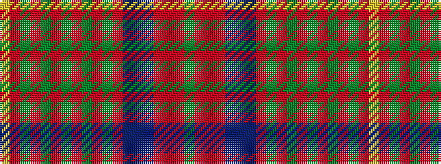

GRRRBBBRGRGRGRGRGRY

It is a 19 stripe tartan.

<figure class="pat-woven">

<figcaption>idealised sample</figcaption>
</figure>

## Colour Sequence



## Tartans with this colour sequence

| Tartans |
|---------------|
| [Wcwm 1528](/variants/s19/dg3r2o2r2n20db3n3r8dg2r2dg2r2dg8o2dg2o2dg2o8ly3~x2/)|
||
