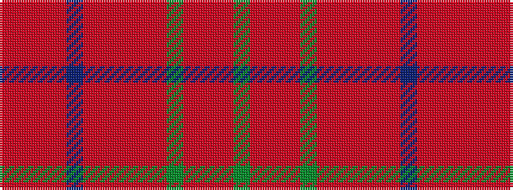

GRRRGRRRRRBRRRR

It is a 15 stripe tartan.

<figure class="pat-woven">

<figcaption>idealised sample</figcaption>
</figure>

## Colour Sequence



## Tartans with this colour sequence

| Tartans |
|---------------|
| [MacDougall 6](/setts/s15/g18ri6m4r6g20r6m4r6m4ri6db22r8ri6m4r5/)|
||
| [Unidentified #35](/setts/s15/dg18ri6m4r6dg20r6m4r6m4ri6db22r8ri6m4r5/)|
||
