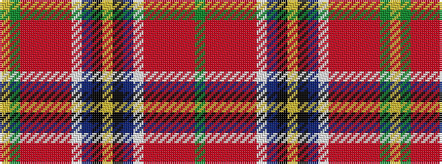

GRRRRRWBKYKBWRRRRRGY

It is a 20 stripe tartan.

<figure class="pat-woven">

<figcaption>idealised sample</figcaption>
</figure>

## Colour Sequence



## Tartans with this colour sequence

| Tartans |
|---------------|
| [Heston](/variants/s20/dg8o12m3o9m3o12lb9db48k8lo2k8db48lb9o12m3o9m3o12dg8lo2~x2/)|
||
