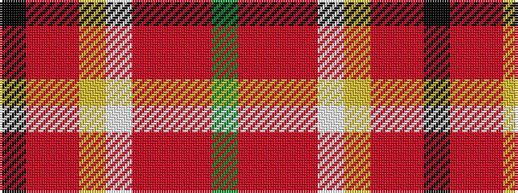

GRRRWYRRK

It is a 9 stripe tartan.

<figure class="pat-woven">

<figcaption>idealised sample</figcaption>
</figure>

## Colour Sequence



## Tartans with this colour sequence

| Tartans |
|---------------|
| [Australian Donkey (Corporate)](/variants/s9/k4oi13ri3lr7w3o25r2o3dy4~x2/)|
||
