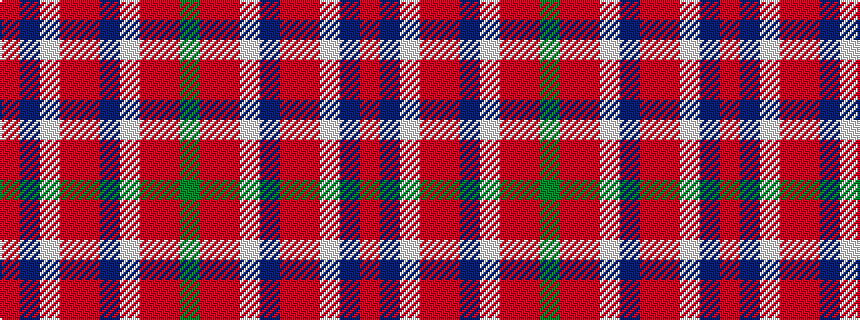

GRRWBRRWBR

It is a 10 stripe tartan.

<figure class="pat-woven">

<figcaption>idealised sample</figcaption>
</figure>

## Colour Sequence



## Tartans with this colour sequence

| Tartans |
|---------------|
| [Fearns McIntosh Millennium (Personal)](/variants/s10/r8dt2lb1o1r8dt2lb1o1r8g2~x6/)|
||
