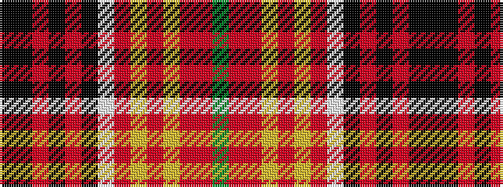

GRRYRYRWKRKRKK

It is a 14 stripe tartan.

<figure class="pat-woven">

<figcaption>idealised sample</figcaption>
</figure>

## Colour Sequence



## Tartans with this colour sequence

| Tartans |
|---------------|
| [Downs Dress (Personal)](/setts/s14/k68k1r6k4r1k12w1r6ly1r24ly1r2r3g3~x2/)|
||
