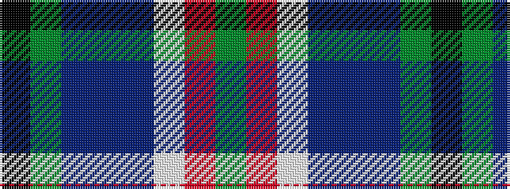

GRWBBBGK

It is a 8 stripe tartan.

<figure class="pat-woven">

<figcaption>idealised sample</figcaption>
</figure>

## Colour Sequence



## Tartans with this colour sequence

| Tartans |
|---------------|
| [Stewarton](/setts/s8/k2y5b7b7b7lp6o5g2~x2/)|
||
