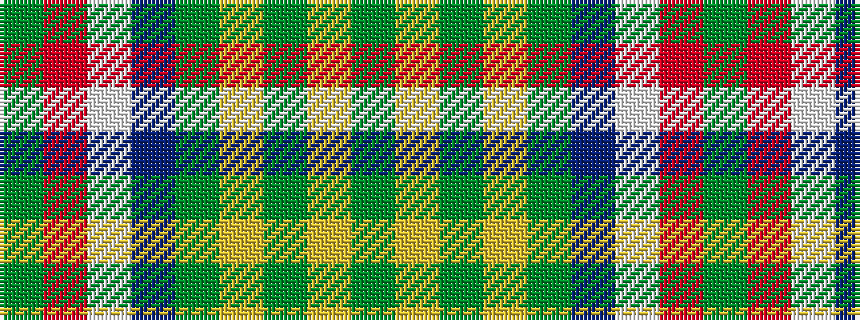

GRWBGYGYG

It is a 9 stripe tartan.

<figure class="pat-woven">

<figcaption>idealised sample</figcaption>
</figure>

## Colour Sequence



## Tartans with this colour sequence

| Tartans |
|---------------|
| [Nickel Lodge, Centennial](/variants/s9/y18ly1y2ly1y2db6w4o1g6~x2/)|
||
