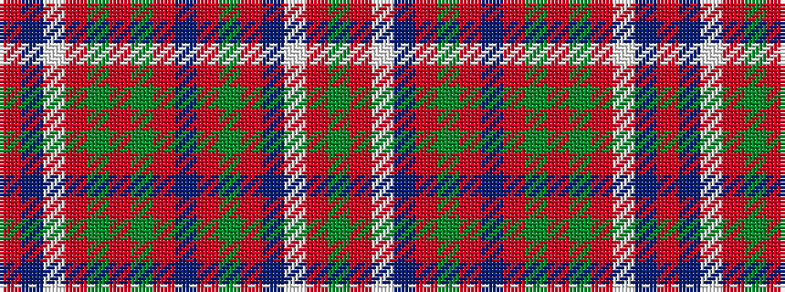

GRWBRGRBRGRGRWBR

It is a 16 stripe tartan.

<figure class="pat-woven">

<figcaption>idealised sample</figcaption>
</figure>

## Colour Sequence



## Tartans with this colour sequence

| Tartans |
|---------------|
| [Stewart of Appin](/variants/s16/r3db2lb1r2dg24r4dg2r2db8r2dg2r24db2lb1r2dg2~x2/)|
||
