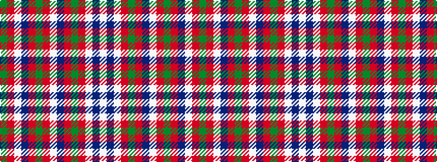

GRWBRGRWBRGRWBW

It is a 15 stripe tartan.

<figure class="pat-woven">

<figcaption>idealised sample</figcaption>
</figure>

## Colour Sequence



## Tartans with this colour sequence

| Tartans |
|---------------|
| [Glenorchy #2](/setts/s15/g3r2lbi1b18r2g8r4lb1b8r2g18r2lbi1b3lb1~x2/)|
||
