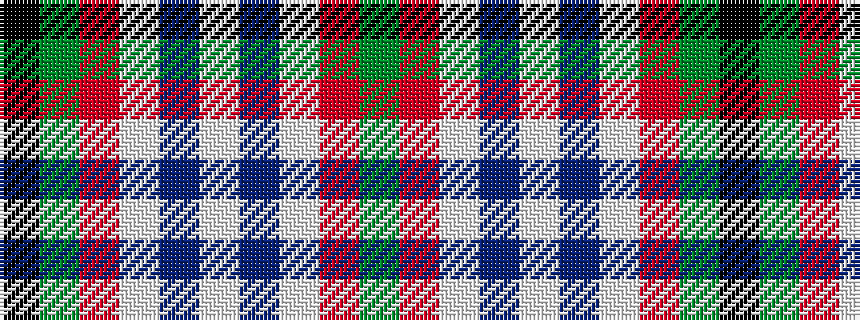

GRWBWBWRGK

It is a 10 stripe tartan.

<figure class="pat-woven">

<figcaption>idealised sample</figcaption>
</figure>

## Colour Sequence



## Tartans with this colour sequence

| Tartans |
|---------------|
| [Rollings Personal Tartan](/variants/s10/g55r4lb3dp11w4db11lb3r4g55k4~x2/)|
||
