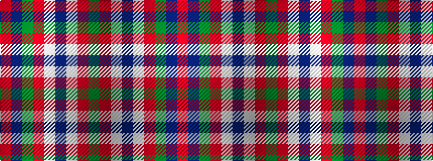

GRWBWRGBR

It is a 9 stripe tartan.

<figure class="pat-woven">

<figcaption>idealised sample</figcaption>
</figure>

## Colour Sequence



## Tartans with this colour sequence

| Tartans |
|---------------|
| [Brousseau (Personal)](/variants/s9/y25r2lb2db2lb2r13dy28db2r3~x2/)|
||
