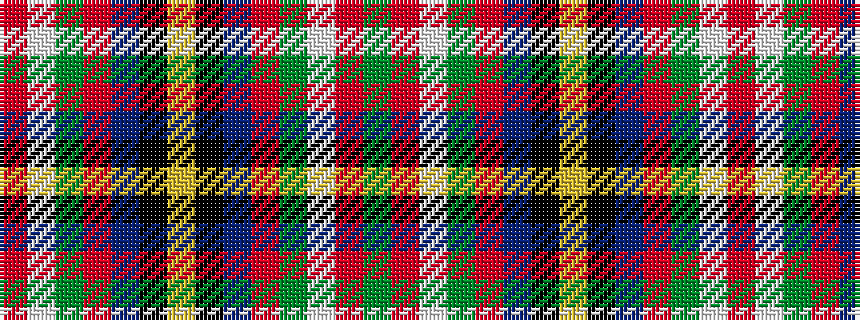

GRWGRBKYKBRGWR

It is a 14 stripe tartan.

<figure class="pat-woven">

<figcaption>idealised sample</figcaption>
</figure>

## Colour Sequence



## Tartans with this colour sequence

| Tartans |
|---------------|
| [Stirling University #2](/variants/s14/g22r3w1g2r3t16k3ly2~x4/)|
||
