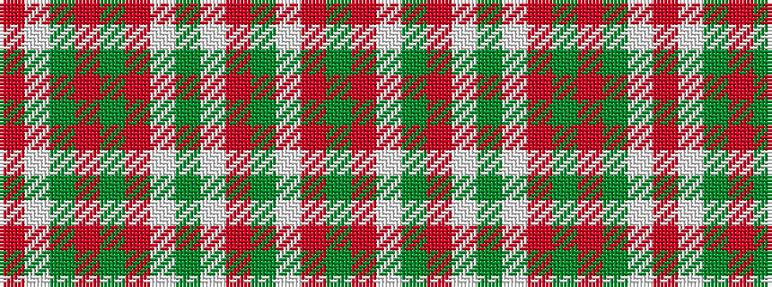

GRWGRWGWRGRGWR

It is a 14 stripe tartan.

<figure class="pat-woven">

<figcaption>idealised sample</figcaption>
</figure>

## Colour Sequence



## Tartans with this colour sequence

| Tartans |
|---------------|
| [Mordente](/setts/s14/r1w1g1r16g7r1w1g1w1r1g7w2r1g1~x2/)|
||
| [Mordente (Personal)](/setts/s14/r2w1g1r16g7r1w1g1w1r1g7w2r1g2~x2/)|
||
| [Mordente (Personal)](/setts/s14/r2w1g1r16g7r1w1g1w1r1g7w2r1g2~x4/)|
||
