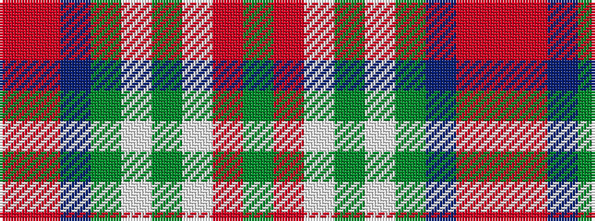

GRWGWGBRR

It is a 9 stripe tartan.

<figure class="pat-woven">

<figcaption>idealised sample</figcaption>
</figure>

## Colour Sequence



## Tartans with this colour sequence

| Tartans |
|---------------|
| [State Seal of Mississippi (Fashion)](/setts/s9/y48o26lbi5dy7lb10y3b7o10r3~x2/)|
||
