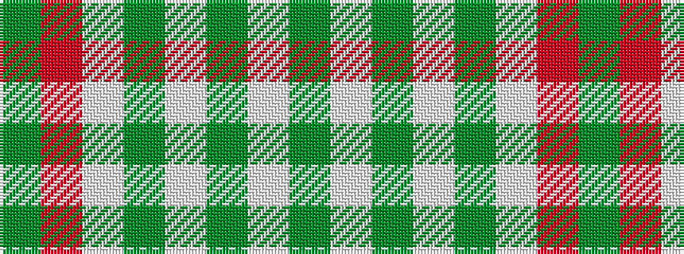

GRWGWGWG

It is a 8 stripe tartan.

<figure class="pat-woven">

<figcaption>idealised sample</figcaption>
</figure>

## Colour Sequence



## Tartans with this colour sequence

| Tartans |
|---------------|
| [Manitoba Dress (Dance)](/setts/s8/g3r10lb2gii3lb13gi2lb2gi3~x2/)|
||
