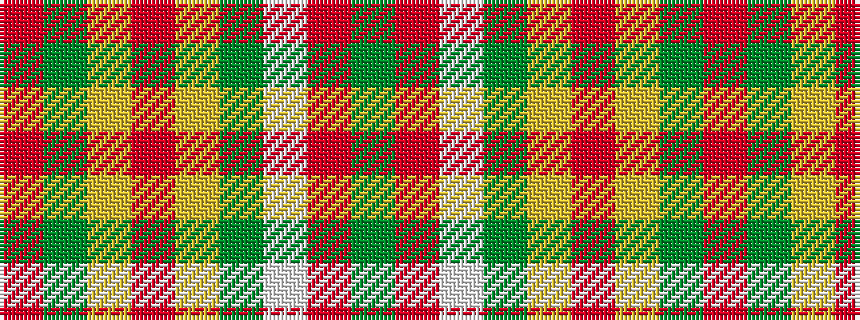

GRWGYRYGR

It is a 9 stripe tartan.

<figure class="pat-woven">

<figcaption>idealised sample</figcaption>
</figure>

## Colour Sequence



## Tartans with this colour sequence

| Tartans |
|---------------|
| [Henry W.A. Canadian Tartan](/variants/s9/dy24r24w3g21ly2r1ly2dy6r2~x2/)|
||
