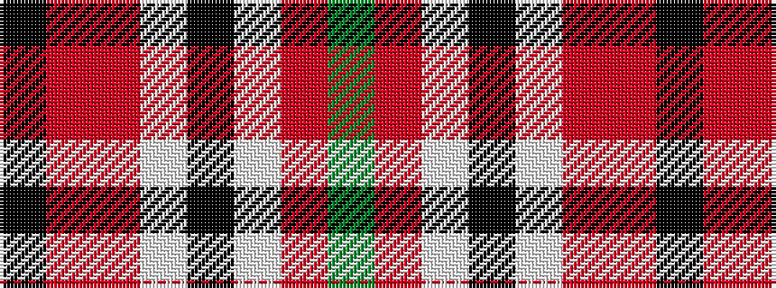

GRWKWRRK

It is a 8 stripe tartan.

<figure class="pat-woven">

<figcaption>idealised sample</figcaption>
</figure>

## Colour Sequence



## Tartans with this colour sequence

| Tartans |
|---------------|
| [Humphries (Name)](/setts/s8/g18r1lb2k1lb2r1o6k2~x4/)|
||
