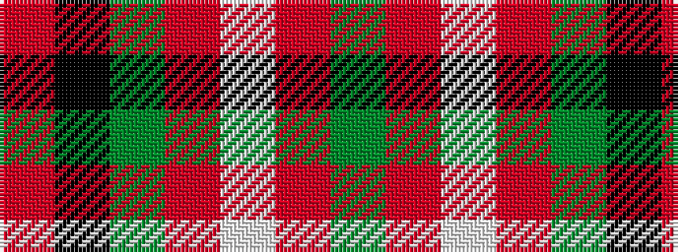

GRWRGKR

It is a 7 stripe tartan.

<figure class="pat-woven">

<figcaption>idealised sample</figcaption>
</figure>

## Colour Sequence



## Tartans with this colour sequence

| Tartans |
|---------------|
| [Mangles, Peter and Annette (Personal](/setts/s7/r20k5dg5r5w5o3dg3~x4/)|
||
